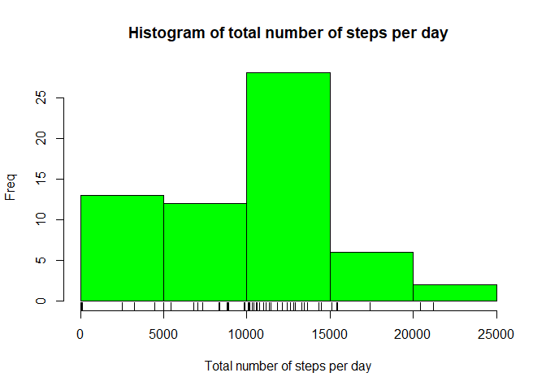
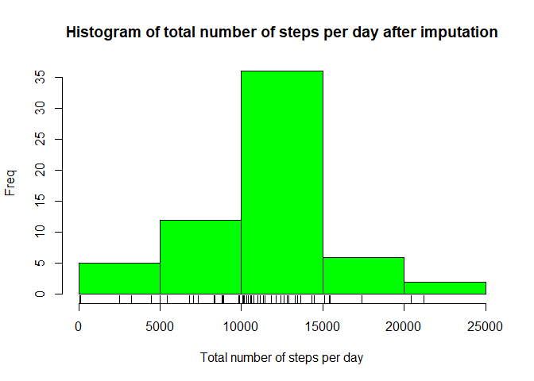

# Course Project 1
Armin Najarpour Foroushani

## Loading and preprocessing the data

```r
setwd("C:/To do/R/Reproducible Research/Course Project 1")
activity<-read.csv("activity.csv",header=TRUE)
head(activity)
```

```
##   steps       date interval
## 1    NA 2012-10-01        0
## 2    NA 2012-10-01        5
## 3    NA 2012-10-01       10
## 4    NA 2012-10-01       15
## 5    NA 2012-10-01       20
## 6    NA 2012-10-01       25
```

```r
dim(activity)
```

```
## [1] 17568     3
```

## What is mean total number of steps taken per day?
1. Calculate the total number of steps taken per day

```r
SPD <- as.data.frame.table(tapply(activity$steps,list(activity$date),sum,na.rm=TRUE))
names(SPD)<-c("Day","Total_Steps")
head(SPD)
```

```
##          Day Total_Steps
## 1 2012-10-01           0
## 2 2012-10-02         126
## 3 2012-10-03       11352
## 4 2012-10-04       12116
## 5 2012-10-05       13294
## 6 2012-10-06       15420
```
2. Make a histogram of the total number of steps taken each day

```r
hist(SPD$Total_Steps,col="green",xlab = "Total number of steps per day",ylab = "Freq",main = "Histogram of total number of steps per day")
rug(SPD$Total_Steps)
```

<!-- -->

3. Calculate and report the mean and median of the total number of steps taken per day

```r
cat("Mean SPD",mean(SPD$Total_Steps))
```

```
## Mean SPD 9354.23
```

```r
cat("Median SPD",median(SPD$Total_Steps))
```

```
## Median SPD 10395
```

## What is the average daily activity pattern?
1. Make a time series plot (i.e. type = "l") of the 5-minute interval (x-axis) and the average number of steps taken, averaged across all days (y-axis)

```r
SPI <- as.data.frame.table(tapply(activity$steps,list(activity$interval),mean,na.rm=TRUE))
names(SPI)<-c("Interval","Mean_Steps")

library(ggplot2)
ggplot(data=SPI, aes(x=Interval, y=Mean_Steps, group=1)) + geom_line(linetype = "solid",colour = "blue") + scale_x_discrete(breaks = round(seq(0, 2355, by = 500),1)) + labs(x = "Interval", y = "Number of Steps")
```

<!-- -->

2. Which 5-minute interval, on average across all the days in the dataset, contains the maximum number of steps?

```r
cat("Max 5-min interval:",which.max(SPI$Mean_Steps))
```

```
## Max 5-min interval: 104
```

## Imputing missing values
1. Calculate and report the total number of missing values in the dataset

```r
cat("Total number of NAs in steps",sum(is.na(activity$steps)))
```

```
## Total number of NAs in steps 2304
```

```r
cat("Percentage of NAs in steps",mean(is.na(activity$steps)))
```

```
## Percentage of NAs in steps 0.1311475
```
2. Devise a strategy for filling in all of the missing values in the dataset. 

We used the mean for that 5-minute interval.

3. Create a new dataset that is equal to the original dataset but with the missing data filled in.

```r
NaFill_activity <- activity
for (val in which(is.na(NaFill_activity$steps))){
        interval_val = NaFill_activity$interval[val]
        NaFill_activity$steps[val] = SPI$Mean_Steps[SPI$Interval == interval_val]
}
```
4. Make a histogram of the total number of steps taken each day and Calculate and report the mean and median total number of steps taken per day. Do these values differ from the estimates from the first part of the assignment? What is the impact of imputing missing data on the estimates of the total daily number of steps?

```r
NaFill_SPD <- as.data.frame.table(tapply(NaFill_activity$steps,list(NaFill_activity$date),sum,na.rm=TRUE))
names(NaFill_SPD)<-c("Day","Total_Steps")
head(NaFill_SPD)
```

```
##          Day Total_Steps
## 1 2012-10-01    10766.19
## 2 2012-10-02      126.00
## 3 2012-10-03    11352.00
## 4 2012-10-04    12116.00
## 5 2012-10-05    13294.00
## 6 2012-10-06    15420.00
```

```r
hist(NaFill_SPD$Total_Steps,col="green",xlab = "Total number of steps per day",ylab = "Freq",main = "Histogram of total number of steps per day after imputation")
rug(NaFill_SPD$Total_Steps)
```

<!-- -->

```r
cat("Mean SPD",mean(NaFill_SPD$Total_Steps))
```

```
## Mean SPD 10766.19
```

```r
cat("Median SPD",median(NaFill_SPD$Total_Steps))
```

```
## Median SPD 10766.19
```
Imputing missing values increased both the mean and median of the total number of steps taken each day. 
It pushes the values to the mean and the resulting histogram will be closer to the normal distribution.

## Are there differences in activity patterns between weekdays and weekends?
1. Create a new factor variable in the dataset with two levels – “weekday” and “weekend” indicating whether a given date is a weekday or weekend day.

```r
weekdays_vec <- c('Monday', 'Tuesday', 'Wednesday', 'Thursday', 'Friday')
dated_weekdays <- weekdays(as.Date(as.character(NaFill_activity$date)))

NaFill_activity$wDay <- factor((dated_weekdays %in% weekdays_vec), levels=c(FALSE, TRUE), labels=c('weekend','weekday'))

head(NaFill_activity$wDay)
```

```
## [1] weekday weekday weekday weekday weekday weekday
## Levels: weekend weekday
```

2. Make a panel plot containing a time series plot (i.e. type="l") of the 5-minute interval (x-axis) and the average number of steps taken, averaged across all weekday days or weekend days (y-axis). See the README file in the GitHub repository to see an example of what this plot should look like using simulated data.

```r
SPI_Na <- as.data.frame.table(tapply(NaFill_activity$steps,list(NaFill_activity$interval,NaFill_activity$wDay),mean,na.rm=TRUE))
names(SPI_Na)<-c("Interval","wDay","Mean_Steps")

ggplot(data=SPI_Na, aes(x=Interval, y=Mean_Steps, group=1)) + geom_line(linetype = "solid",colour = "blue") + scale_x_discrete(breaks = round(seq(0, 2355, by = 500),1)) + labs(x = "Interval", y = "Number of Steps") + facet_grid(wDay ~ .)
```

<!-- -->
